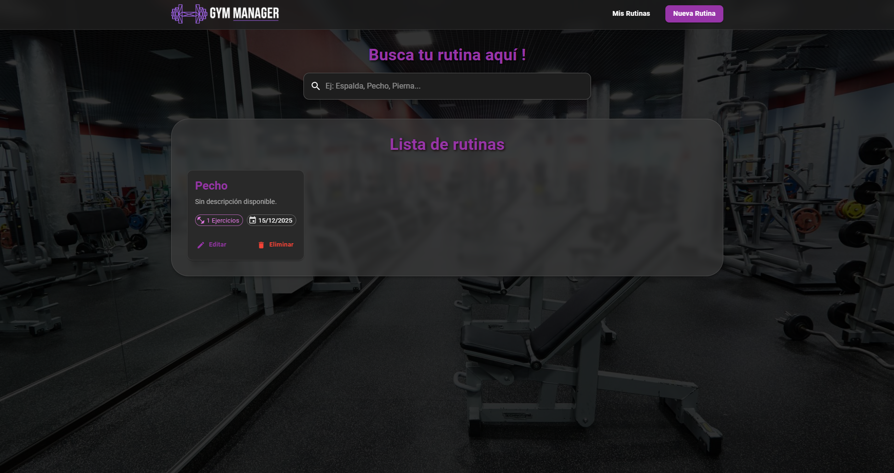

# Gym Manager - Sistema de Gestión de Rutinas

> **Proyecto Final - Cátedra Programación IV**
> Universidad Tecnológica Nacional (UTN)

## 📋 Descripción del Proyecto

**Gym Manager** es una aplicación web Fullstack diseñada para facilitar la creación, organización y seguimiento de rutinas de entrenamiento. Permite a los usuarios gestionar sus ejercicios diarios, series, repeticiones y cargas a través de una interfaz moderna e intuitiva.

El objetivo principal es reemplazar las tradicionales libretas de papel por una solución digital responsive, accesible tanto desde computadoras de escritorio como desde dispositivos móviles.

## 📸 Capturas

[Pantalla de Inicio]



## 🚀 Características Principales

* **Gestión de Rutinas (CRUD):** Crear, Leer, Editar y Eliminar rutinas completas.
* **Detalle de Ejercicios:** Agregado dinámico de ejercicios con validaciones inteligentes (no permite guardar rutinas vacías).
* **Diseño Responsive:** Interfaz adaptada a móviles (menús compactos, formularios full-width) y escritorio usando **Material UI**.
* **Feedback Visual:** Alertas de error, confirmaciones y estados de carga.
* **Base de Datos Relacional:** Persistencia robusta de datos complejos (Rutinas <-> Ejercicios).

## 🛠️ Tecnologías Utilizadas

### Frontend 🎨
* **React** (Vite): Construcción de la interfaz de usuario.
* **Material UI (MUI):** Componentes visuales y sistema de diseño responsive.
* **Axios:** Comunicación con la API.
* **React Router:** Navegación SPA (Single Page Application).

### Backend ⚙️
* **Python 3.10+**: Lenguaje principal.
* **FastAPI:** Framework de alto rendimiento para la creación de APIs.
* **SQLModel / SQLAlchemy:** ORM para la gestión de base de datos.
* **Pydantic:** Validación de datos.

### Base de Datos 🗄️
* **PostgreSQL:** Motor de base de datos relacional.

---

## 🔧 Instalación y Configuración

Sigue estos pasos para correr el proyecto localmente.

### Prerrequisitos
* Node.js y npm instalados.
* Python 3.10 o superior instalado.
* PostgreSQL instalado y corriendo.

### 1. Configuración de la Base de Datos
Crea una base de datos en PostgreSQL (puedes usar pgAdmin o DBeaver) llamada `gym_db`.

### 2. Clonar o descargar el proyecto
```bash
   git clone <url-del-repositorio>
   ```

### 3. Configuración del Backend

```bash
# Entrar a la carpeta backend
cd backend

# Crear entorno virtual
python -m venv venv

# Activar entorno virtual
# En Git Bash
source venv/Scripts/activate
# En Windows:
venv\Scripts\activate
# En Mac/Linux:
source venv/bin/activate

# Instalar dependencias
pip install fastapi uvicorn

# Iniciar el servidor
python -m uvicorn app.main:app --reload

```
### 4. Configuración del Frontend 🎨

Una vez que el backend esté funcionando, abre una **nueva terminal** (no cierres la del backend) y sigue estos pasos:

```bash
    # Entrar a la carpeta del frontend
    cd frontend

    # Instalar dependencias
    npm install

    # Iniciar el servidor de desarrollo
    npm run dev
```

Ingresar a http://localhost:5173 (o el puerto que te indique la consola) para ver el proyecto funcionando.
