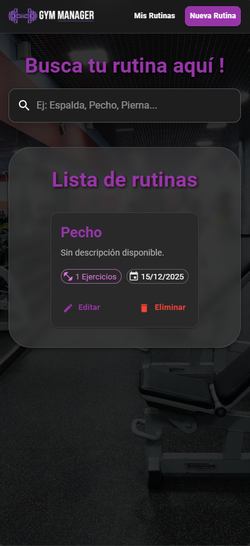

# Gym Manager - Sistema de Gestión de Rutinas **(Frontend)**

> **Proyecto Final - Cátedra Programación IV**
> Universidad Tecnológica Nacional (UTN)

## 📋 Descripción del Proyecto

Este directorio contiene el código fuente de la **Interfaz de Usuario (SPA)** del proyecto Gym Manager. 
Está construida utilizando **React** bajo el entorno de desarrollo **Vite**, lo que garantiza una experiencia rápida y optimizada.

El diseño visual se apoya en **Material UI (MUI)** para ofrecer una estética moderna, limpia y **totalmente responsive**, asegurando que la gestión de rutinas sea cómoda tanto en dispositivos móviles (modo app) como en escritorio.

## 🚀 Características de la Interfaz

* **SPA (Single Page Application):** Navegación fluida sin recargas de página gracias a *React Router*.
* **Diseño Adaptable (Responsive):**
    * Menú de navegación optimizado (Barra superior en PC / Adaptación móvil).
    * Formularios inteligentes que aprovechan el ancho de pantalla.
    * Grillas dinámicas para visualizar tarjetas de rutinas.
* **Feedback Visual:**
    * Indicadores de carga (Spinners).
    * Alertas de error y éxito.
    * Validaciones de formulario en tiempo real antes de enviar datos al servidor.
* **Conexión API:** Comunicación asíncrona con el backend mediante *Axios*.

## 🛠️ Tecnologías y Librerías

Este proyecto utiliza las siguientes dependencias principales:

* **Core:** `React`, `React DOM`.
* **Build Tool:** `Vite`.
* **UI Framework:** `@mui/material`, `@emotion/react`, `@emotion/styled`.
* **Iconos:** `@mui/icons-material`.
* **Navegación:** `react-router-dom`.
* **Peticiones HTTP:** `axios`.

## 📸 Capturas de Pantalla


| Vista de Escritorio | Vista Móvil |
|:---:|:---:|
|  |  |

> *Nota: Las imágenes son ilustrativas del diseño responsive.*

## 🔧 Instalación y Ejecución

Sigue estos pasos para levantar el entorno de desarrollo del frontend.

### Prerrequisitos
* Tener **Node.js** instalado (versión 16 o superior recomendada).
* Tener el **Backend** de Gym Manager corriendo (por defecto en el puerto 8000).

### Pasos

1.  **Instalar dependencias:**
    Descarga todas las librerías necesarias listadas en `package.json`.
    ```bash
    npm install
    ```

2.  **Iniciar el servidor de desarrollo:**
    Levanta la aplicación en modo local con recarga rápida (HMR).
    ```bash
    npm run dev
    ```

3.  **Acceder a la aplicación:**
    Por lo general, Vite iniciará la aplicación en:
    > http://localhost:5173

## 📂 Estructura del Proyecto

* `/src/api`: Configuración de Axios y endpoints.
* `/src/components`: Componentes reutilizables (Navbar, Cards).
* `/src/pages`: Vistas principales (Home, Crear Rutina, Editar Rutina).
* `/public`: Recursos estáticos (Logos, imágenes).